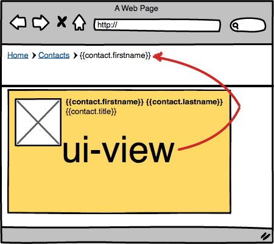

# angular-import-scope

> Import a scope from another ui-view.

Angular.JS structures your data in nested scopes. Which is great, except when page structure doesn’t work like that and you need the inner data on a much higher level (say in the navigation). With import-scope, you can import the scope of a lower-level ui-view somewhere higher up.

**Note**: This depends upon the excellent [ui-router](https://github.com/angular-ui/ui-router).




## Usage
Add angular-import-scope to your project:

```
bower install --save angular-import-scope
```

Add it to your HTML file:

```html
<script src="bower_components/angular-import-scope/dist/angular-import-scope.min.js"></script>
```

Reference it as a dependency for your app module:

```js
angular.module('myApp', ['rt.importscope']);
```

Link to a named ui-view somewhere to import the scope:

```html
<div id="header" import-scope="content@app">
    <h1>{{title || "No title"}}</h2>
</div>
```

**Note:** You need to specify the full name, which is of the form `viewname@statename`.


## License 

    (The MIT License)

    Copyright (C) 2014 by Ruben Vermeersch <ruben@rocketeer.be>

    Permission is hereby granted, free of charge, to any person obtaining a copy
    of this software and associated documentation files (the "Software"), to deal
    in the Software without restriction, including without limitation the rights
    to use, copy, modify, merge, publish, distribute, sublicense, and/or sell
    copies of the Software, and to permit persons to whom the Software is
    furnished to do so, subject to the following conditions:

    The above copyright notice and this permission notice shall be included in
    all copies or substantial portions of the Software.

    THE SOFTWARE IS PROVIDED "AS IS", WITHOUT WARRANTY OF ANY KIND, EXPRESS OR
    IMPLIED, INCLUDING BUT NOT LIMITED TO THE WARRANTIES OF MERCHANTABILITY,
    FITNESS FOR A PARTICULAR PURPOSE AND NONINFRINGEMENT. IN NO EVENT SHALL THE
    AUTHORS OR COPYRIGHT HOLDERS BE LIABLE FOR ANY CLAIM, DAMAGES OR OTHER
    LIABILITY, WHETHER IN AN ACTION OF CONTRACT, TORT OR OTHERWISE, ARISING FROM,
    OUT OF OR IN CONNECTION WITH THE SOFTWARE OR THE USE OR OTHER DEALINGS IN
    THE SOFTWARE.
